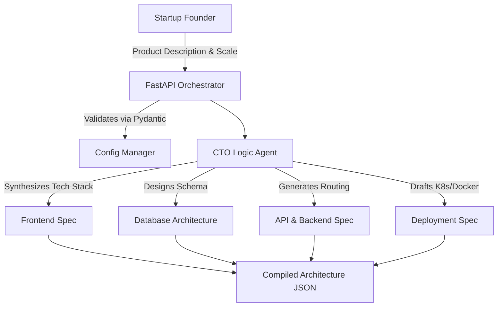

<div align="center">
  <h1>🧠 Minute CTO</h1>
  <p><b>The Autonomous AI Co-Founder & Instant Tech Stack Architect</b></p>

  
  
  
  
  
</div>

<br>

---

## ⚡ Executive Summary

The era of spending $200k+ on a technical co-founder to build boilerplate startup infrastructure is over. 

**Minute CTO** is a local autonomous AI agent that acts as your Chief Technology Officer. You provide it with a simple product description and your target user scale, and the agent instantly analyzes your requirements to generate your optimal tech stack, database schemas, and API architectures in under 60 seconds.

By running entirely on your local machine, Minute CTO ensures that your billion-dollar ideas are never logged by third-party APIs or leaked to competitors.

## 🏗️ Agentic Architecture Overview

Built on a blazing-fast **FastAPI** backend, the engine uses a highly modular design pattern, separating the HTTP orchestration from the core LLM processing logic.



## ✨ Core Capabilities

*   **Instant Architecture:** Turns raw text ("I want to build a social network for dogs") into a fully fleshed out, highly scalable backend architecture instantly.
*   **Zero Cloud Dependency:** Run your requirements locally so your proprietary app concepts aren't logged by external language models.
*   **Enterprise-Grade Modularity:** Designed with strict adherence to MVC and Domain-Driven Design (DDD). Configs, models, and agent services are deeply decoupled.
*   **Strict Type Validation:** All inputs and outputs are rigidly validated via Pydantic `BaseModel` classes to prevent hallucination errors.

---

## 📂 Project Structure

```text
minute-cto/
├── src/
│   ├── api/
│   │   └── router.py       # FastAPI HTTP endpoints
│   ├── core/
│   │   └── config.py       # Pydantic BaseSettings & Env Loaders
│   ├── models/
│   │   └── architecture.py # Pydantic schemas (Requirements, Output)
│   ├── services/
│   │   └── agent.py        # Core autonomous CTO reasoning logic
│   └── main.py             # ASGI Application Entrypoint
├── tests/
│   └── test_main.py        # Pytest suites
├── .github/workflows/
│   └── ci.yml              # Automated CI/CD pipelines
├── Makefile                # Quickstart commands
└── requirements.txt        # Strict dependency locking
```

---

## 🚀 Quick Start Guide

### Prerequisites
*   Python 3.10 or higher
*   (Optional) An active `.env` file for custom agent tuning.

### 1. Installation

Clone the repository and install dependencies instantly using the built-in Makefile:
```bash
git clone https://github.com/lakshanmuruganandam/minute-cto.git
cd minute-cto
make install
```

### 2. Configuration (Optional)

Create a `.env` file in the root directory to tune the agent's behavior:
```ini
ENVIRONMENT=production
MODEL_TEMPERATURE=0.2
```

### 3. Boot the Engine

```bash
make run
```
The API will be available at `http://127.0.0.1:8000`. You can interact with the auto-generated Swagger UI documentation at `http://127.0.0.1:8000/docs`.

### 4. Run the Test Suite

We enforce strict reliability. Run the test suite:
```bash
make test
```

---

## 🗺️ Future Roadmap

- [ ] **Phase 2:** Implement auto-generation of actual boilerplate `.js` and `.py` files.
- [ ] **Phase 3:** Integrate a local Vector Database (ChromaDB) to grant the CTO agent memory of past architectural decisions.
- [ ] **Phase 4:** Automatic Dockerfile generation and local container spinning based on the synthesized architecture.

## 🤝 Contributing

We welcome contributions from engineers and founders! Please follow our strict CI guidelines:
1. Fork the repository.
2. Create your feature branch (`git checkout -b feature/NewFeature`).
3. Ensure all tests pass (`make test`).
4. Open a Pull Request.

## 📝 License

Distributed under the MIT License. See `LICENSE` for more information.
