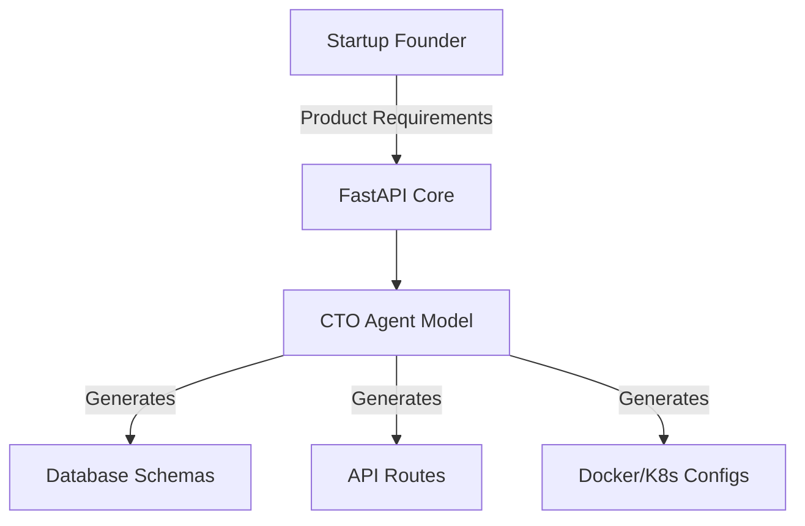

<div align="center">
  <h1>🧠 Minute CTO</h1>
  <p><b>Autonomous Agent for Instant Tech Stack Architecture</b></p>

  
  
  
  
  
</div>

<br>

---

## ⚡ Executive Summary

The era of spending $200k+ on a technical co-founder to build boilerplate startup infrastructure is over. 

**Minute CTO** is a local autonomous agent that acts as your Chief Technology Officer. You provide it with a simple product description and target user scale, and the agent instantly generates your optimal tech stack, database schemas, and API architectures in under 60 seconds.

## 🏗️ Architecture Overview

Built on a blazing-fast **FastAPI** backend, the agent processes requirements locally, ensuring absolute privacy for your startup ideas.



## ✨ Core Capabilities

*   **Instant Architecture:** Turns "I want to build a social network for dogs" into a fully fleshed out, scalable backend architecture instantly.
*   **Zero Cloud Dependency:** Run your requirements locally so your million-dollar ideas aren't logged by OpenAI or Anthropic servers.
*   **Production-Ready:** Engineered with Python 3.10+, complete with CI/CD pipelines and a comprehensive test suite out of the box.

---

## 🚀 Quick Start Guide

### Prerequisites
*   Python 3.10 or higher

### 1. Installation

Clone the repository and install dependencies instantly using the built-in Makefile:
```bash
git clone https://github.com/lakshanmuruganandam/minute-cto.git
cd minute-cto
make install
```

### 2. Boot the Engine

```bash
make run
```
The API will be available at `http://127.0.0.1:8000`. You can interact with the auto-generated Swagger UI documentation at `http://127.0.0.1:8000/docs`.

### 3. Run the Test Suite

```bash
make test
```

## 📝 License

Distributed under the MIT License. See `LICENSE` for more information.
